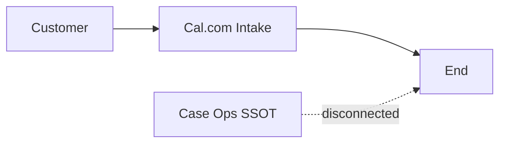
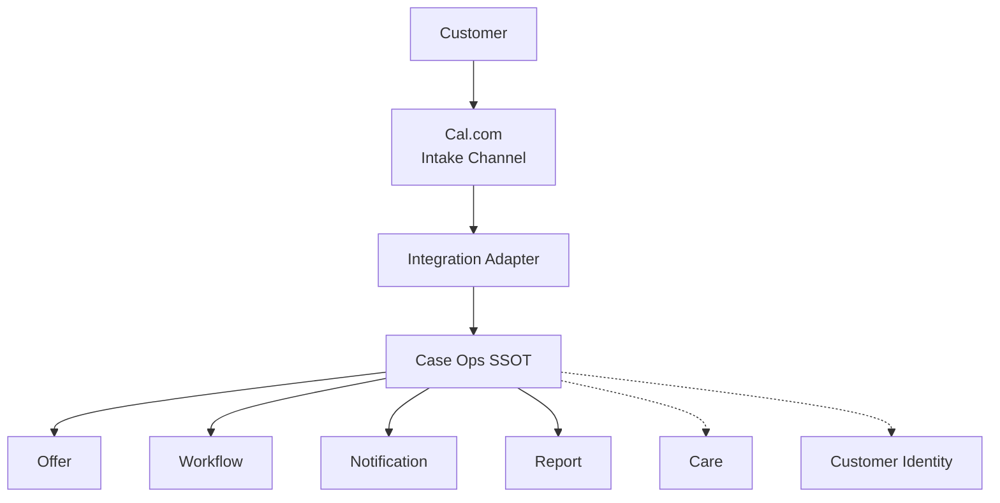

# Cal.com Booking Integration — Design Decision Record

**Document type:** Design Decision Closure (DDR)  
**Status:** **CLOSED** — decisions locked for architecture alignment  
**Mode:** Architecture Decision Closure Only — **no code, no patch, no webhook, no endpoint, no flags, no deploy, no implementation detail**  
**Date:** 2026-08-05  
**Authors (role):** Principal Software Architect + Domain Reviewer  

**Supersedes open items in:** `docs/CALCOM_INTEGRATION_ARCHITECTURE_READINESS.md` (§7.2 blockers)  
**Aligned with:** `docs/verification/01`–`04`, `06`; `docs/M8.9_IDENTITY_GOVERNANCE.md`; `docs/PRODUCTION_ARCHITECTURE_REVIEWER.md`

**Non-goals of this DDR:** runtime behavior change, Framer rewrite, Customer/Care flag enable, Offer algorithm rewrite, Notification ownership change.

---

## Decision summary (locked)

| # | Topic | Decision |
|---|--------|----------|
| 1 | Boundary | **A — Cal.com = External Intake Channel only** (not a Domain) |
| 2 | Case creation trigger | **BOOKING_CREATED** → create Case via existing Case entry (`createCase`) |
| 3 | Booking identity | **Primary: `calBookingId`** on Case; **Secondary: webhook delivery / event id** for dedupe |
| 4 | Idempotency | M5 30s **not sufficient**; durable Cal-key dedupe **required** (requirement only) |
| 5a | Cancel | **Option A — update existing Case** (cancel appointment semantics) |
| 5b | Reschedule | **Option A — update same Case** appointment fields |
| 6 | Ownership | Case remains Ops SSOT; Cal never owns workflow/notify/offer truth |
| 7 | Offer attribution | Map Cal **event type** → existing `launchOffer` / `campaignOffer` (no new Offer store) |
| 8 | Failures | Fail closed on auth/validation; ack only after durable Case success or durable dedupe hit |
| 9 | Backfill | **A — ไม่ import** ใน v1 |
| 10 | QA | QA-CAL-01…10 required before production cutover |

**Architecture Status:** **READY FOR IMPLEMENTATION** (design closed; implementation not started by this document)

---

# 1. Boundary Decision

## Decision: **A — Cal เป็นแค่ Intake Channel**

| | |
|--|--|
| **เลือก** | **A** |
| **ไม่เลือก** | B (Cal เป็น Booking Domain) |

### Why A

- Verification + M8.9 already lock **Booking ownership on Case**.  
- Making Cal a Booking Domain creates a second Ops SSOT and breaks Offer-from-Case, Dashboard-from-Case, and Care anchors-from-Case.  
- Cal already exists as customer UX; architecture must **ingest**, not **cede**.

### Impact of A

| Area | Impact |
|------|--------|
| Case | Remains Ops SSOT after ingest |
| Offer | Continues counting Cases only |
| Customer / Care | Unchanged; flags stay OFF |
| Cal | Keeps calendar UX + Cal-native ids; not ops truth |
| Adapter | Thin translator only — not a domain |

### Impact if B were chosen (rejected)

- Dual booking truth; Offer would need Cal reads or dual count  
- Cancel/reschedule/workflow split across systems  
- Violates production architecture reviewer rules (“Booking belongs to Case”)

### AS-IS Diagram

```text
Customer
   ↓
Cal.com Embed
   ↓
Cal.com storage
   ↓
 (จบ)

Case / Offer / Workflow / Notification / Care / Dashboard
   = ไม่เชื่อม
```



### TO-BE Diagram

```text
Customer
   ↓
Cal.com  = External Intake Channel
   ↓
Integration Adapter  = not a Domain Owner
   ↓
Case Domain APIs  (create / cancel / update appointment)
   ↓
Case = Ops SSOT
   ↓
Offer | Workflow | Notification | Report | Care(read later)
```



---

# 2. Case Creation Policy

## Decision

| Event | Creates Case? |
|-------|----------------|
| **BOOKING_CREATED** | **Yes** — sole Cal-origin create trigger for v1 |
| PAYMENT_COMPLETED | **No** — not in current Free Water Check / Cal path; would invent payment domain |
| MANUAL_CONFIRMATION | **No** as Cal path — Manual Create remains separate Portal UC; not required after Cal book |
| อื่น ๆ (RESCHEDULED / CANCELLED) | **No create** — update only |

### Who creates the Case?

| Role | Actor |
|------|--------|
| **Publisher of intent** | Cal.com (BOOKING_CREATED) |
| **Creator of Case aggregate** | **Case Domain** via existing **`createCase()`** entry (invoked by Adapter) |
| **Adapter** | Maps + authorizes + dedupes; **does not** own Case |

### Who owns after create?

| | |
|--|--|
| **Owner** | **Case Domain** (Ops SSOT) |
| Cal | Retains Cal booking record as intake artifact only |
| Customer | Not owner of booking; optional identity dual-write remains flag-gated (OFF) |
| Care | Not involved at create |

**Invariant:** One Cal booking id → at most one Case created for that booking (see §3–§4).

---

# 3. Booking Identity Decision

## Mapping

```text
Cal Booking ID  ──persist──►  Case.externalCalBookingId  (name illustrative)
Webhook Event / Delivery ID ──dedupe──►  processed-event registry
```

## Identifiers to retain

| Identifier | Required? | Role |
|------------|-----------|------|
| **`calBookingId`** | **Required** | **Primary identity** linking Cal ↔ Case |
| **`calEventTypeId` / slug** | Required for Offer map | Attribution (not Case primary key) |
| **Webhook event id / delivery id** | Required for dedupe | **Secondary identity** for exactly-once *processing* |
| **Event timestamp** | Recommended | Ordering, late/out-of-order detection, audit |
| `externalReference` (generic) | Optional alias | Only if equal to `calBookingId`; do not invent a second primary |

## Selection

| | Choice |
|--|--------|
| **Primary identity** | **`calBookingId`** stored on Case; lookup for cancel/reschedule by exact match only |
| **Secondary identity** | **Webhook event / delivery id** for replay protection |

**Forbidden:** name/phone fuzzy match to attach Cal events to Cases.

---

# 4. Idempotency Decision

## Is M5 30-second API protection enough for Cal webhooks?

### **No.**

| M5 today | Cal reality |
|----------|-------------|
| Short TTL fingerprint on `POST /api/cases` | Cal retries over minutes–hours; process may restart |
| Protects burst double-submit | Does not protect webhook redelivery after TTL or across instances restart |

M5 remains valid for direct API callers. Cal path **adds** durable requirements; it does **not** replace or rewrite M5.

## Requirements (design only — no implementation)

| Requirement | Decision |
|-------------|----------|
| **Duplicate prevention key** | At minimum: `(calBookingId + eventType)` for create; `(webhookEventId)` for any delivery; cancel/reschedule keyed by `calBookingId` + event kind |
| **Event replay handling** | Replay of CREATED after success → return prior success, **zero** new Cases; replay CANCEL → idempotent cancelled; replay RESCHEDULE → same Case, same or updated times without second Case |
| **Retry behavior** | On transient Case/Notion failure → non-success response so Cal retries; on permanent validation/auth failure → non-retryable rejection |
| **Persistence requirement** | Dedup state must survive process restart for at least the Cal retry horizon (ops-defined, **≫ 30s**). In-memory-only is **insufficient** for Cal CREATED |

---

# 5. Lifecycle Decision

## Booking Created

```text
Cal BOOKING_CREATED
  → Adapter (verify, validate, dedupe)
  → createCase(...)
  → Case exists (Ops SSOT)
```

Expected: one Case; system defaults (`notificationStatus=not_sent`, tokens, workflow scheduled); Offer invalidate if campaign attributed.

## Booking Cancelled — **Option A**

| | |
|--|--|
| **เลือก** | **Option A — update existing Case** (cancel appointment / cancelled workflow semantics already in Case domain) |
| **ไม่เลือก** | Option B (cancellation event only without Case update) — leaves Dashboard/Offer wrong |
| **ไม่เลือก** | Create new “cancellation Case” |

### Effects (Cancel A)

| Area | Effect |
|------|--------|
| Offer | Active launch Case removed from count (existing cancel + cache invalidate behavior) |
| Workflow | Case marked cancelled; not a parallel cancel ledger |
| Notification | **No** change to result-send machine unless already constrained by cancel guards |
| Audit | Case history + logs; not Care audit |

**Guard (locked):** If Case is already **in_progress** or **closed**, Adapter must **not** silently force-cancel; surface for ops policy (reject or no-op + alert). Scheduled/new only auto-cancel.

## Booking Rescheduled — **Option A**

| | |
|--|--|
| **เลือก** | **Option A — update appointment fields on the same Case** |
| **ไม่เลือก** | Option B (cancel + create new Case) — doubles Offer burn risk and fragments workflow/tokens |

### Effects (Reschedule A)

| Area | Effect |
|------|--------|
| Offer | **Unchanged** slot (same Case remains active) |
| Workflow | Same Case id; status unchanged unless ops rules say otherwise |
| Notification | Untouched |
| Audit | Appointment field change on Case; retain `calBookingId` |

If Cal emits cancel+create pair instead of reschedule for a “move,” design still prefers **correlate to same Case** via stable `calBookingId` when Cal preserves it; if Cal issues a **new** booking id with no link, treat as new CREATED only after product confirms — default assumption for v1 is Cal preserves booking id on reschedule (must be verified against real payloads at implement time, without changing this policy).

---

# 6. Data Ownership Matrix

| Field | Cal Owner | Case Owner | Customer Owner | Sync Direction |
|-------|-----------|------------|----------------|----------------|
| bookingId (`calBookingId`) | **Yes** (native) | **Copy** for correlation | No | **Cal → Case** (once at create; immutable) |
| appointment date/time | Cal calendar UX | **Yes (ops SSOT after ingest)** | No | **Cal → Case** on create/reschedule |
| appointment / Cal booking status | Cal UI | No (not Case workflow) | No | Informational only; **do not** mirror as workflow |
| name | Attendee submit | **Yes** (booking fields) | Identity if linked later | **Cal → Case** on create |
| phone | Attendee / custom | **Yes** | Identity if linked | **Cal → Case** |
| email | Attendee | **Yes** | Identity if linked | **Cal → Case** |
| LINE (handle / lineId) | Custom Q if any | **Yes** (`lineId`) | No for handle | **Cal → Case** optional |
| LINE User ID | No | **Yes** (link flow) | Projection when flags on | **Not from Cal** |
| consent | If collected on Cal | Case booking consent field if mapped | Customer consent separate | Cal → Case only if field exists; else omit |
| workflow status | **No** | **Yes** | No | **None from Cal** (except cancel path via Case API) |
| notification status | **No** | **Yes** | No | **Forbidden from Cal** |
| report token | **No** | **Yes** (system) | No | Created by Case on create only |

---

# 7. Offer Integration Decision

## How does a Cal booking know which Offer?

### Decision

| Mechanism | Role |
|-----------|------|
| **Cal event type** (id/slug of Free Water Check vs Full Assessment) | **Primary discriminator** |
| Map event type → existing Case options | Free Water Check → **`launchOffer: true`** (resolves to current Launch campaign via existing Case/Offer rules) |
| Explicit `campaignOffer` string | Allowed if needed; must match existing campaign naming — **no new Offer DB** |
| `campaignId` / `launchOfferId` as new Portal concepts | **Not introduced** in this DDR |
| Arbitrary Cal metadata blob as Offer SoT | **Rejected** — Offer SoT remains Case campaign props + M3 count |

### Effects

| Area | Effect |
|------|--------|
| **Slot counting** | CREATED with launch attribution increments used; CANCEL frees; RESCHEDULE no change |
| **Analytics** | Case `campaignOffer` + `source=cal.com` (or equivalent source marker) — Case-owned fields |
| **Rollback** | Disable intake → new Cal books stop entering Offer count; existing Cases remain |

**Product confirmation (non-blocking for architecture):** confirm which Cal event type(s) map to Launch Offer before production cutover — mapping table is configuration under this decision, not a new domain.

---

# 8. Failure Architecture

| # | Case | Expected behavior | Owner | Recovery |
|---|------|-------------------|-------|----------|
| 1 | Webhook ซ้ำ | Dedupe hit; no new Case; success-equivalent response | Adapter + durable dedupe | None needed |
| 2 | Event ช้า | Apply if still valid; create/cancel/reschedule per policy | Adapter + Case | Ops reviews late creates; twin Manual Case → ops merge-by-id rule (no fuzzy auto-merge) |
| 3 | Event ย้อนหลัง (out of order) | Prefer timestamp + state guards: ignore cancel if unknown id (alert); ignore reschedule if Case cancelled; never un-cancel from stale create | Adapter + Case | Alert; manual ops |
| 4 | Notion unavailable | Fail closed (non-success); no false “booked in Portal” | Case persistence | Cal retry + dedupe → single Case |
| 5 | Customer data ไม่ครบ | Reject create if required Case fields missing (e.g. name); no partial Case | Adapter validation → Case validation | Fix Cal form questions; resubmit/new book |
| 6 | Signature invalid | Reject; no mutation | Security / Adapter | Fix secret; no Case repair |
| 7 | Cancel มาก่อน/ไม่ตรงลำดับ | If Case exists → cancel if allowed; if not exists → alert + durable record of orphan cancel (no Case invent) | Adapter + Case | Ops; optional later create-then-cancel only by human policy — **not** auto invent Case from cancel |

**Ack rule (locked):** Durable Case success **or** durable dedupe replay ⇒ ack. Validation/auth failure ⇒ reject. Transient dependency failure ⇒ fail for retry.

---

# 9. Backfill Decision

## Decision: **A — ไม่ import** (v1)

| Option | |
|--------|--|
| **A ไม่ import** | **Selected** |
| B Manual migration | Deferred — separate signed ops plan only if product requires |
| C Automated migration | **Rejected** for v1 |

### Reasons

- Avoid Offer slot shock and duplicate Case risk when webhook goes live.  
- Historical Cal-only bookings were never Ops SSOT; importing silently rewrites capacity truth.  
- v1 goal is **forward** parity: new Cal books → Case.

### Consequence

Open future Cal appointments that predate webhook remain Cal-only until ops handles them manually outside this DDR (or a future backfill DDR).

---

# 10. QA Design — QA-CAL Matrix

| ID | Scenario | Expected | Owner | Risk |
|----|----------|----------|-------|------|
| **CAL-01** | Booking Created | One Case; tokens; `notificationStatus=not_sent`; Dashboard visible | Case / Adapter | Mapping gaps |
| **CAL-02** | Duplicate Event | Zero second Case; Offer unchanged | Adapter dedupe | Double offer burn |
| **CAL-03** | Cancel | Case cancelled; Offer frees if launch; Dashboard hides cancelled | Case cancel | Cancel after start |
| **CAL-04** | Reschedule | Same Case id; new times; Offer unchanged | Case update | Accidental create |
| **CAL-05** | Invalid Signature | Reject; no Case change | Security | Outage if secret wrong |
| **CAL-06** | Payload Missing | Reject create; no Case | Validation | Silent drop if mis-acked |
| **CAL-07** | Notion Failure | Non-success; retry → one Case | Case / Notion | Lost or dup book |
| **CAL-08** | Replay Event | Same as CAL-02 across restart horizon | Adapter persistence | Restart gap |
| **CAL-09** | Offer Attribution | Free Water Check decrements remaining; non-launch does not | Offer / mapping | Wrong campaign |
| **CAL-10** | Rollback | Intake disabled; no new Cases from Cal; existing Cases intact | Ops / Architecture | Partial cutover confusion |

Regressions required with CAL set: existing QA-B01–B04, QA-O01–O03 (verification matrix).

---

# Final Verdict

## Architecture Status: **READY FOR IMPLEMENTATION**

Design decisions above are **closed**. Cal.com Integration is defined as an **extension intake path into existing Case architecture**, not a competing Booking Domain.

### Blocking Decisions

**None remaining at architecture/DDR level.**

### Non-blocking confirmations before production cutover (ops/product, not redesign)

1. Exact Cal event type ↔ Launch Offer mapping values  
2. Real payload samples validate that reschedule preserves `calBookingId`  
3. Formal sign-off of this DDR by Product + Eng lead + Ops  
4. Manual QA execution of QA-CAL-* + booking/offer regressions  

### Explicitly still forbidden by this closure

- Changing Case / Customer / Care / Offer / Notification ownership  
- Enabling Customer or Care flags as part of Cal work  
- Treating Cal as Offer or workflow SoT  
- Auto-backfill of historical Cal bookings in v1  

---

## Sign-off block

| Role | Name | Date | Result |
|------|------|------|--------|
| Architecture | | | ☐ Approve DDR |
| Product | | | ☐ Approve Offer map + no backfill |
| Ops | | | ☐ Approve cancel-after-start guard + rollback |
| Eng Lead | | | ☐ Approve READY FOR IMPLEMENTATION |

**Until sign-off cells are filled by humans, implementation scheduling is an organizational choice; architecture decisions themselves are recorded as CLOSED in this document.**
