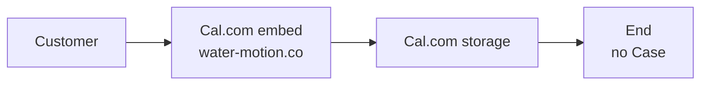
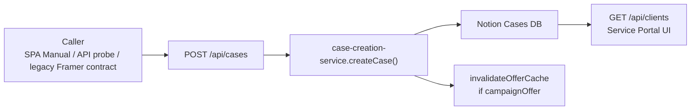
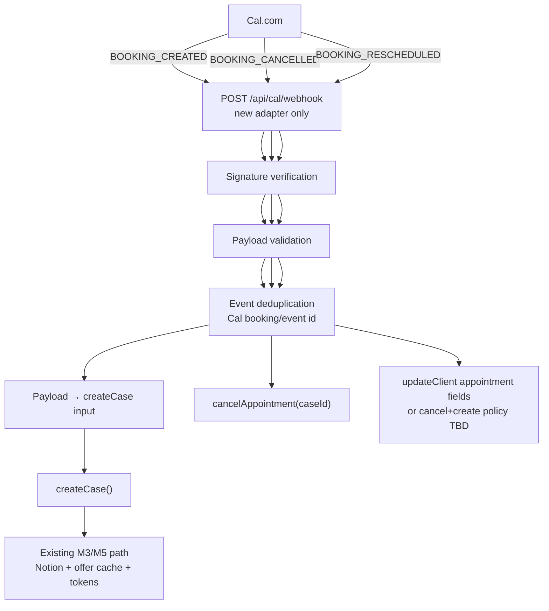

# Cal.com → Case Bridge — Architecture Review

**Status:** Analysis & proposal only — **not approved for implementation in this document**  
**Mode:** Design + plan — **no code, no patch, no flag enable, no deploy**  
**Date:** 2026-08-05  
**Related finding:** Runtime booking gap — public site uses Cal.com; Service Portal `POST /api/cases` is never called from that UI  

**Architecture locks (must preserve):**

| Rule | Implication for this bridge |
|------|-----------------------------|
| **Case = Ops SSOT** | Bridge creates/updates **Case** only; Cal.com is an intake channel, not a second ops DB |
| **Customer = Identity only** | No new identity model; dual-write remains existing M8 path (flags OFF = no-op) |
| **Care ⊥ Case Notification** | Bridge must not touch Care SEND / result `notificationStatus` |
| **No ownership move** | Do not move booking ownership to Customer, Care, or Cal.com |
| **Do not rewrite M3/M5** | Offer counter + booking hardening stay; bridge **calls** `createCase()` / `cancelAppointment()` |
| **Single create entry** | **`createCase()`** is the only path that creates a Case from Cal intake |

**Out of scope for this review:** Framer form rewrite, Cal.com UI redesign, enabling Customer/Care flags, Notion schema redesign, Offer algorithm changes.

**Evidence baseline (runtime, 2026-08-05):**

- Public booking: `https://www.water-motion.co` → Cal.com embed `app.cal.com/watermotion/60min`
- Framer → Portal: `GET /api/public/water-check-offer` only (spots counter)
- No `POST /api/cases` from booking page; no Cal.com references in Service Portal codebase
- Portal: Notion ready; `POST /api/cases` validates; `GET /api/clients` returns Cases

---

## 1. AS-IS Flow Diagram

### 1.1 Public booking (current customer path)



```text
Customer
  → Cal.com (embed on Framer)
  → Cal.com storage / Cal calendar
  → (จบ — ไม่เข้า Service Portal / Notion / Dashboard)
```

**Gap (จุดที่ flow ขาด):** after Cal.com accepts the booking, there is **no** webhook, poller, or Zap that calls Service Portal. Ops SSOT (Case) never learns about the appointment.

### 1.2 Backend booking path (exists, unused by public site)



```text
POST /api/cases
  → withIdempotency (short TTL fingerprint)
  → createCase()
      → map / validate (fullName required)
      → resolveCampaignOffer (launchOffer → Launch Offer 2026)
      → createClient (Notion)
      → dualWriteAfterCaseSuccess (flags OFF = no-op)
      → booking_created log
  → Notion Cases
  → Service Portal dashboard via GET /api/clients
```

### 1.3 Parallel read-only counter (not create)

```text
Framer snippet
  → GET /api/public/water-check-offer
  → counts Cases with campaignOffer (excl. cancelled)
  → renders “N spots left”
```

This path **does not** create bookings. Cal.com bookings **do not** decrement the counter unless a Case with `campaignOffer` is created elsewhere.

### 1.4 Gap summary

| Segment | Status |
|---------|--------|
| Customer → Cal.com book | Works |
| Cal.com → Service Portal | **Missing** |
| Service Portal → Notion Case | Works when `createCase` runs |
| Notion → Dashboard | Works |
| Offer counter accuracy vs Cal books | **Diverges** (Cal books invisible to M3) |

---

## 2. TO-BE Architecture Proposal

**Principle:** Add a **thin Cal.com intake adapter**. Do **not** rewrite the booking system. Reuse M3 offer + M5 create/cancel/idempotency behaviors by calling existing services.

### 2.1 Target flow



```text
Cal.com
  → Webhook Endpoint (new; Cal-owned intake)
  → Signature Verification
  → Validation
  → Deduplication (durable enough for webhook retries)
  → Payload Mapping → Case customer fields + options.launchOffer
  → createCase()                          # CREATE only here
  → Existing M3/M5 Flow (Notion, offer invalidate, system defaults)

  CANCEL → resolve Case by calBookingId → cancelAppointment()
  RESCHEDULE → update appointment on same Case (preferred) OR documented cancel+create
```

### 2.2 What must not change

| Keep | Do not |
|------|--------|
| `createCase()` as sole Case creator for this bridge | Duplicate Notion `pages.create` in webhook handler |
| `cancelAppointment()` for cancel semantics | Invent a second cancel status machine |
| Offer counting via `campaignOffer` on Case | Count Cal.com bookings directly in offer API |
| Case `notificationStatus` / Care audits | Fire Care or result LINE from Cal webhook |
| Short-TTL `withIdempotency` on `POST /api/cases` | Rely on 30s TTL alone for Cal retries (need **event-id** dedup) |

### 2.3 Suggested module boundaries (design only)

| Module | Responsibility | Must not own |
|--------|----------------|--------------|
| `api/cal-routes.js` (proposed) | HTTP, signature, 2xx/4xx | Business create rules |
| `services/cal-booking-adapter.js` (proposed) | Map Cal payload → `createCase` / cancel / reschedule calls | Notion schema; Offer math |
| Existing `case-creation-service` | Case lifecycle | Cal API details |
| Existing `water-check-offer-service` | Slot counts from Cases | Knowing Cal exists |

### 2.4 Correlation / external id (design requirement)

Store a stable **Cal booking id** on the Case so cancel/reschedule can resolve the row without fuzzy name match.

| Approach | Notes |
|----------|--------|
| **Preferred:** dedicated Case property e.g. `External Booking ID` / `Cal Booking ID` | Exact lookup; no fuzzy merge |
| Alternative: encode in `source` or notes | Fragile; avoid as primary key |
| Forbidden | Name/phone fuzzy match to attach cancel to Case |

Exact Notion property name is a **pre-implement check** (schema + alias in mapper).

---

## 3. Impact Analysis

| Area | Current | After Bridge | Risk |
|------|---------|--------------|------|
| **Booking** | Public → Cal only; Portal create unused by site | Cal webhook → `createCase()` | Medium — mapping bugs create incomplete Cases |
| **Offer Counter** | Counts Launch Offer Cases; Cal books ignored (`used` understates demand) | Created Cases with `launchOffer:true` / `campaignOffer` decrement remaining | **High if backfill wrong** or double-count; **Medium** if launchOffer not set on Cal Free Water Check |
| **Notion** | Cases from Manual/API only | + Cases from Cal | Low if `createClient` reused; Medium if new props missing |
| **Dashboard** | Shows Notion Cases; cancelled filtered | New Cal-origin Cases appear after create | Low |
| **Idempotency** | 30s fingerprint on `POST /api/cases` | Need **Cal event/booking id** dedup (hours+) | **High** without durable dedup — duplicate Cases |
| **Retry** | Cal retries webhooks; Portal create retries Notion via existing patterns | Adapter must ack only after durable success **or** allow safe replay via dedup | Medium — premature 200 → lost booking; late 500 → dup without dedup |
| **Notification** | Result notify is Case workflow; booking create sets `not_sent` | Unchanged if bridge only create/cancel/reschedule | Low — **do not** send LINE from Cal webhook |
| **Cancellation** | `cancelAppointment` + offer invalidate | Cal CANCEL → same | Medium — must resolve Case by external id |
| **Reschedule** | No first-class API today (update fields / manual) | Need explicit policy | **High** — wrong policy → duplicate Cases or orphan slots |
| **Care Eligibility** | Based on Case service/result anchors | Unaffected at booking time | Low — new Cases may later become Care-eligible like any Case; no Care call at bridge |

---

## 4. Events to Support (minimum)

### 4.1 BOOKING_CREATED

| | |
|--|--|
| **Trigger** | Cal.com webhook: booking created / meeting scheduled (exact trigger name TBD from Cal docs + sample payload) |
| **Expected action** | Map payload → call **`createCase(payload, { launchOffer: true \| false, skipMap: true, correlationId })`**; persist `calBookingId` on Case |
| **Data affected** | Notion Case row; system tokens; offer cache if campaign; optional Customer dual-write (flags OFF) |
| **Failure case** | Invalid/missing name → 4xx, no Case; Notion down → 5xx, Cal retries; dup event → return prior success (no second Case) |

### 4.2 BOOKING_CANCELLED

| | |
|--|--|
| **Trigger** | Cal.com booking cancelled |
| **Expected action** | Resolve Case by `calBookingId` → **`cancelAppointment(caseId)`** (idempotent if already cancelled) |
| **Data affected** | Case workflow/status cancelled; offer cache invalidate if had `campaignOffer` |
| **Failure case** | Unknown booking id → log + 200/404 policy TBD (prefer **ack + alert**, avoid infinite Cal retry storms); Case already in_progress/closed → **do not** blindly cancel without ops rule |

### 4.3 BOOKING_RESCHEDULED

| | |
|--|--|
| **Trigger** | Cal.com reschedule (new time; often same booking id or linked ids — **confirm in payload**) |
| **Expected action (preferred)** | Update same Case: `appointmentDate` / `appointmentStart` / `appointmentEnd` via `updateClient`; **do not** create a second Case |
| **Expected action (fallback only)** | Cancel old + create new — only if Cal issues new booking id and product accepts slot accounting side effects |
| **Data affected** | Appointment fields on Case; offer count usually **unchanged** if same campaign Case remains active |
| **Failure case** | Treating reschedule as create → **duplicate Case + double offer burn**; missing link between old/new id → orphan |

---

## 5. Data Mapping Draft (not implemented)

| Cal.com Field (expected) | Internal Field | Owner Domain | Notes |
|--------------------------|----------------|--------------|-------|
| Attendee name / title | `fullName` | **Case** (booking fields) | **Required** by `validateCustomerInput` |
| Attendee email | `email` | Case | Confirm location in payload (attendees[] vs responses) |
| Attendee phone / SMS | `phone` | Case | Often custom question — **confirm** |
| Custom: LINE ID | `lineId` | Case | **Not** LINE User ID; custom booking question if needed |
| Start time | `appointmentDate` + `appointmentStart` | Case | Timezone: Cal UTC vs Bangkok — **confirm** |
| End time | `appointmentEnd` | Case | Duration from event type |
| Event type slug / id | `packageHistory` and/or `source` | Case | Map Free Water Check vs Full Assessment |
| Booking uid / id | `calBookingId` (proposed Case prop) | Case | **External correlation key** |
| — | `campaignOffer` / `options.launchOffer` | Case / Offer | Free Water Check → launch offer; Full paid → no launch or different campaign |
| — | `source` | Case | e.g. `cal.com` for audit |
| Location / address | `address` | Case | Cal location field or custom question — **confirm** |
| — | System tokens, workflow, notify status | Case (system) | From `buildSystemDefaults` inside `createCase` |
| — | Customer record | Customer | Only via existing dual-write; flags OFF |

### Fields that **must** be confirmed from a real Cal.com webhook payload before coding

1. Exact JSON paths for name, email, phone, start/end, timezone  
2. Event type identifier for Free Water Check vs other  
3. Stable booking id across create / cancel / reschedule  
4. Whether reschedule sends `BOOKING_RESCHEDULED` vs cancel+create pair  
5. Custom question keys (LINE ID, address, property type) if configured in Cal  
6. Webhook signature header name + signing algorithm (Cal version)  
7. Retry / delivery guarantees and idempotent event id  

---

## 6. Security Analysis

| Topic | Requirement | Notes |
|-------|-------------|--------|
| **Webhook signature** | Verify HMAC (or Cal’s documented scheme) on raw body before parse-trust | Mirror LINE pattern: reject 401 on mismatch; never process unsigned in production |
| **Replay attack** | Signature + timestamp skew window **and** event-id dedup | Signature alone ≠ enough if body is replayed within skew |
| **Duplicate events** | Persist processed `calEventId` / `bookingId+trigger` beyond 30s | In-memory store (current booking idempotency) is **insufficient** for Cal retries across restarts |
| **Invalid payload** | Schema validate; missing `fullName` → 4xx; do not partial-write Notion | Fail closed on create |
| **Secret management** | `CAL_WEBHOOK_SECRET` (name TBD) in env only; never log secret or full PII payloads | Ops readiness probe: configured boolean only |
| **Endpoint exposure** | Public HTTPS path; no session auth; signature is auth | Rate-limit / payload size caps recommended at implement time |
| **Privilege** | Webhook may only create/cancel/reschedule Case booking fields | Must not expose admin, Care SEND, or Customer merge |

---

## 7. QA Matrix Proposal

Leave **Actual / Pass-Fail** blank until human run. Staging first; production Cal webhook only after sign-off.

| ID | Scenario | Expected |
|----|----------|----------|
| **QA-CAL-01** | Booking Created (valid signed webhook) | One Case; tokens; `notificationStatus=not_sent`; offer used +1 if launch; appears in `/api/clients` |
| **QA-CAL-02** | Duplicate Webhook (same event/booking) | Second delivery creates **0** new Cases; 2xx; offer unchanged |
| **QA-CAL-03** | Cancel Booking | Case cancelled; offer remaining +1 if was launch; dashboard hides cancelled |
| **QA-CAL-04** | Reschedule | **Same** Case id; new appointment times; no second Case; offer unchanged |
| **QA-CAL-05** | Invalid Signature | 401; no Case; no offer change |
| **QA-CAL-06** | Mapping Error (e.g. missing name) | 4xx; no Case |
| **QA-CAL-07** | Cal.com timeout / retry storm | After success, retries are no-ops (dedup); no N Cases |
| **QA-CAL-08** | Notion failure on create | 5xx; no silent success; Cal can retry; after recovery exactly one Case |

**Regression (must still pass):** QA-B01–B04, QA-O01–O03, QA-ID patterns — bridge must not break Manual Create or public offer GET.

---

## 8. Backfill Analysis

| Question | Recommendation |
|----------|----------------|
| **Bookings already only in Cal.com** | Treat as **ops import problem**, not automatic silent backfill on day-1 webhook enable |
| **Must import?** | **Optional but recommended** for open future appointments that ops need on Dashboard; historical completed Cal-only visits may stay out of Case if no ops value |
| **How** | Controlled one-shot: export Cal bookings → map → call `createCase` / or steward script with **dry-run report** first; store `calBookingId` to prevent later webhook dup |
| **Risk to Offer Counter** | **High** if all historical Free Water Check rows are imported with `launchOffer` — can consume remaining slots incorrectly. Prefer: backfill with campaign only for **still-valid** launch bookings, or import without campaign and accept counter stays “portal-truth” |
| **Risk to Duplicate Case** | **High** if webhook goes live then backfill without id registry — same Cal booking → two Cases. Order: **(1)** schema + id property, **(2)** backfill with ids, **(3)** enable webhook, **or** webhook first with empty history and **no** backfill |

**Default recommendation:**  
**No automatic backfill in v1 bridge.** Document open Cal bookings for manual ops. If product requires parity, run a **separate, signed-off backfill plan** with dry-run counts vs `remaining` slots.

---

## 9. Final Recommendation

### 9.1 Do or not do?

| Verdict | Rationale |
|---------|-----------|
| **Do (recommended)** — implement a **thin Cal.com → Case bridge** | Public demand already flows through Cal; without a bridge, Ops SSOT and Offer counter will remain wrong by design |
| **Do not** rewrite booking, Framer calendar, M3 offer math, or M5 createCase internals | Gap is **integration**, not core booking logic |
| **Do not** treat Cal.com as SSOT | Case remains ops truth; Cal is intake |

### 9.2 Dependencies before start

1. Product decision: Free Water Check Cal event → always `launchOffer: true`?  
2. Reschedule policy: **update-in-place** (preferred) vs cancel+create  
3. Notion property for `calBookingId` (create or confirm existing)  
4. Durable dedup store design (acceptable ops tradeoff vs in-memory)  
5. Staging Cal webhook + secret available  
6. Sample **real** webhook payloads for create/cancel/reschedule  
7. Explicit **no Care / no result notify** on booking events (already implied)  
8. Backfill: **none** for v1 unless product signs a separate plan  

### 9.3 What to request from Cal.com / admin

- Webhook URL target (staging then prod Portal path)  
- Signing secret + documentation version  
- Event list enabled: created, cancelled, rescheduled  
- Confirmation of booking uid stability  
- Export of open bookings (if backfill later)  
- Custom questions for phone / LINE / address if not standard  
- Timezone settings for the `watermotion/60min` event type  

### 9.4 What to verify before writing code

| Check | Why |
|-------|-----|
| Capture 1 real CREATE payload (redacted) | Mapping draft → concrete paths |
| Capture CANCEL + RESCHEDULE payloads | Avoid wrong event handling |
| Confirm event type id for Free Water Check | Offer attribution |
| Notion schema: can add/alias external booking id | Cancel/reschedule lookup |
| Offer: `used`/`remaining` math with cancelled | Already M3 — regression only |
| `createCase` + `cancelAppointment` contracts unchanged | Entry-point rule |
| Dedup durability across Render restart | QA-CAL-02/07 |
| Security: secret in Render env; not in Framer | Auth boundary |
| Dashboard filter of cancelled | Cancel visibility expectations |
| No collision with `POST /api/cases` Manual Create | Parallel intake OK |

### 9.5 Suggested delivery slices (planning only)

| Slice | Content | Runtime change when built |
|-------|---------|---------------------------|
| **A** | Adapter + CREATE only + signature + dedup + `calBookingId` | New bookings → Case |
| **B** | CANCEL → `cancelAppointment` | Slot + dashboard align |
| **C** | RESCHEDULE update-in-place | Time corrections |
| **D** | Optional backfill (separate approval) | Historical open books |

---

## Decision log (this document)

| Decision | Status |
|----------|--------|
| Bridge via webhook → `createCase()` | **Proposed** |
| Rewrite booking / Cal embed removal | **Rejected** |
| Change M3/M5 algorithms | **Rejected** unless proven defect unrelated to gap |
| Care/Customer flag enable as part of bridge | **Rejected** |
| Auto backfill all Cal history on enable | **Rejected** for v1 |
| Implementation / deploy | **Not started** — requires separate implementation plan + human approval |

---

## References

- Runtime gap investigation (chat / ops notes, 2026-08-05)  
- `services/case-creation-service.js` — `createCase`, `cancelAppointment`  
- `api/case-flow-routes.js` — `POST /api/cases`  
- `services/water-check-offer-service.js` — offer counting  
- `services/idempotency-store.js` — short-TTL only  
- `docs/verification/01_AS_BUILT_ARCHITECTURE.md`  
- `docs/verification/04_QA_MATRIX.md` — extend with QA-CAL-* when implementing  
- LINE webhook signature pattern — `api/line-routes.js` (precedent only)
