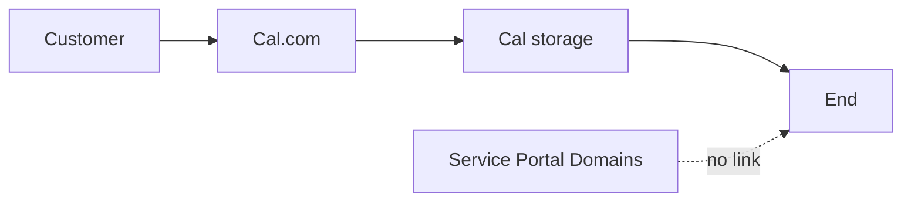
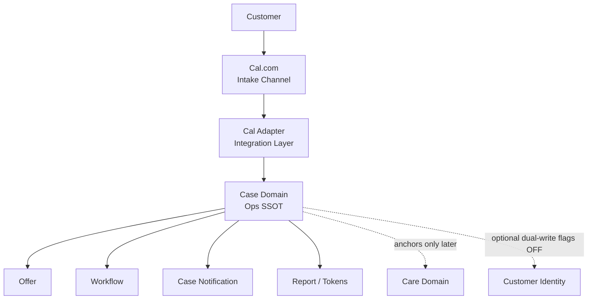

# Architecture Readiness Review — Cal.com Booking Integration

**Role:** Senior Software Architect + Backend System Reviewer  
**Mode:** Architecture Review Only — **no code, no patch, no flags, no deploy, no implementation plan**  
**Date:** 2026-08-05  
**Audience:** Product + Eng leadership alignment before any build  

**Companion docs (do not replace this review):**

- `docs/CALCOM_CASE_BRIDGE_ARCHITECTURE_REVIEW.md` — integration gap & TO-BE sketch  
- `docs/M8.9_IDENTITY_GOVERNANCE.md` — Case vs Customer ownership  
- `docs/PRODUCTION_ARCHITECTURE_REVIEWER.md` — production guardrails  
- `docs/verification/` — as-built verification package  

**Discovery (fact):** Public booking ends in Cal.com. Service Portal Case path (`POST /api/cases` → `createCase()`) is healthy but **not connected** to that UI.

---

## Executive summary

| Question | Answer |
|----------|--------|
| Is the **domain architecture** (Case / Customer / Care / Offer / Notification) sound enough to *receive* Cal bookings? | **Yes** — no ownership migration required |
| Is the **integration design** closed enough to start implementation? | **Yes — closed in DDR** (see supersession) |
| **Final verdict (this doc, historical)** | **B** at time of writing — design was incomplete |

**Supersession:** §7.2 blockers are **closed** by [`docs/CALCOM_BOOKING_INTEGRATION_DESIGN_DECISION_RECORD.md`](./CALCOM_BOOKING_INTEGRATION_DESIGN_DECISION_RECORD.md) → Architecture Status **READY FOR IMPLEMENTATION** (DDR only; no code).

Cal.com must be treated as an **external Intake Channel**, never as Ops SSOT. That fits existing boundaries. Original readiness failure was **unresolved integration policy**, not Case lifecycle maturity (M3/M5/retry/recovery).

---

## 1. Architecture Boundary Review

### 1.1 What is Cal.com in this architecture?

| Question | Answer |
|----------|--------|
| **Cal.com ควรเป็น Domain ไหน?** | **ไม่ใช่ domain ภายในระบบ** — เป็น **External Intake / Scheduling Channel** (peer ของ Framer form หรือ Manual Create), อยู่ชั้น **Adapter / Integration**, ไม่ใช่ Case / Customer / Care / Offer / Notification |
| **Cal.com ควรเป็น Owner ของข้อมูลอะไร?** | ปฏิทินและการจองฝั่งลูกค้าบน Cal เท่านั้น: Cal booking id, Cal event type, Cal-side schedule UI state, attendee form as *submitted to Cal* |
| **ข้อมูลอะไรห้ามให้ Cal.com เป็นเจ้าของ?** | Workflow status, Case notification lifecycle, report/feedback tokens, Offer capacity truth, Care eligibility/audits, Customer identity SSOT, Dashboard ops truth |
| **Case ยังเป็น SSOT ได้หรือไม่?** | **ได้ และต้องเป็น** — หลัง adapter สำเร็จ Case คือแหล่งความจริงฝั่ง ops; Cal เป็นสำเนา/ช่องทางเข้า ไม่ใช่แหล่ง sync กลับมาทับ Case |

### 1.2 Boundary diagram

**AS-IS (broken ops loop)**

```text
Customer
   ↓
Cal.com Embed
   ↓
Cal.com Database
   ↓
  (จบ)

Case / Offer / Notification / Care / Dashboard  = ไม่รับรู้
```



**TO-BE (intake into Case SSOT — ownership unchanged)**

```text
Customer
   ↓
Cal.com  (Intake Channel only)
   ↓
Cal Adapter  (Integration Layer — not a Domain Owner)
   ↓
createCase() / cancelAppointment() / Case appointment update
   ↓
Case  = Ops SSOT
   ↓
Offer | Workflow | Notification | Report | Care(read Case later)
```



### 1.3 Boundary rules (non-negotiable)

1. Adapter **translates events → Case APIs**; it does not become a second booking database inside Portal.  
2. Offer continues to **count Cases**, never Cal rows.  
3. Care and Case result-notification remain **untouched** by booking webhooks.  
4. Customer Domain stays **identity-only**; Cal must not invent Customer ownership of bookings.

---

## 2. Data Ownership Review

| Field | Owner ปัจจุบัน | Owner ที่ควรเป็น | Source (หลังเชื่อม) | Sync ได้หรือไม่ |
|-------|----------------|-------------------|---------------------|-----------------|
| **bookingId (Cal)** | Cal.com only | **Cal.com** owns id; **Case** stores copy as external correlation key | Cal webhook | One-way **Cal → Case** (persist id); ไม่ให้ Cal เป็น SSOT ของ Case |
| **customer name** | Case (เมื่อมี Case); Cal attendee ถ้าจองบน Cal | **Case** (ops denormalized booking fields); Customer identity if/when linked | Cal → `createCase` | Cal→Case on create/update mapping; **ไม่** fuzzy-merge Customer |
| **phone** | Case / Cal custom Q | **Case** booking field | Cal (confirm path) | Cal→Case; normalize later per M8 rules if dual-write |
| **email** | Case / Cal | **Case** booking field | Cal | Cal→Case |
| **LINE ID** (handle) | Case `lineId` if provided | **Case** booking field (not LINE User ID) | Cal custom Q or absent | Optional Cal→Case; **≠** `lineUserId` |
| **LINE User ID** | Case (link flow) | **Case** (ops); Customer projection when flags on | LINE link — **not Cal** | **ห้าม** ให้ Cal เป็น owner |
| **appointment time** | Case fields; Cal calendar | **Case** is ops SSOT after ingest; Cal may diverge if user only changes Cal | Cal create/reschedule | Cal→Case on events; **Case wins for ops** if conflict unresolved |
| **appointment / booking status (Cal)** | Cal | Cal UI status | Cal | Informational; **ไม่** map 1:1 เป็น Case workflow โดยตรงโดยไม่ผ่าน cancel/reschedule policy |
| **cancellation** | Case via `cancelAppointment`; Cal cancel today isolated | **Case** owns cancelled ops state | Cal CANCEL event → Case | Cal→Case cancel; Case ไม่เขียนกลับ Cal ใน v1 (unless product later requires) |
| **reschedule** | Weak/manual on Case; Cal has own | **Case** appointment fields (preferred) | Cal RESCHEDULED | Cal→Case update; **policy must be decided** |
| **notification status** | **Case** | **Case** only | Workflow / send-result — **not Cal** | **ห้าม sync จาก Cal** |
| **workflow status** | **Case** | **Case** only | Portal ops | **ห้ามให้ Cal เป็น owner** |

**Ownership verdict:** Connecting Cal does **not** require moving ownership. It requires an explicit **external-id on Case** and a **one-way ingest** rule so Case remains SSOT.

---

## 3. Event Architecture Review

| Event | Publisher | Consumer | Create or Update Case? | Idempotency required? | Replay effect if unsafe |
|-------|-----------|----------|------------------------|----------------------|-------------------------|
| **BOOKING_CREATED** | Cal.com | Cal Adapter → `createCase()` | **Create** Case | **Yes** — durable on Cal booking/event id (30s fingerprint alone **ไม่พอ**) | Duplicate Cases; Offer over-count |
| **BOOKING_CANCELLED** | Cal.com | Adapter → `cancelAppointment(caseId)` | **Update** (cancel) | **Yes** — cancel already partially idempotent; still dedupe webhook deliveries | Repeated cancels mostly safe; unknown id → noise/alerts |
| **BOOKING_RESCHEDULED** | Cal.com | Adapter → update appointment on **same** Case (preferred) | **Update** | **Yes** — especially if Cal also emits cancel+create | Wrong handling → **second Case** or lost time |

### 3.1 Event principles

- Portal domains are **consumers**, not publishers of Cal events.  
- Downstream Portal events (`booking_created` logs, offer cache invalidate) remain **effects of Case services**, not Cal-native.  
- Replay must be **safe**: same Cal booking id ⇒ same Case id outcome.  
- No Care publish, no result-notify transition from these events.

### 3.2 Publisher/consumer diagram

```text
Cal.com  ===publisher===>  BOOKING_* events
                              │
                         Cal Adapter  ===consumer / translator===>
                              │
                    Case services (create / cancel / update)
                              │
              Offer cache, Notion Case, Dashboard read model
```

---

## 4. Existing System Impact

| Area | Impacted? | Nature of impact | Design constraint |
|------|-----------|------------------|-------------------|
| **M3 Offer counting** | **Yes** | New Cases with `campaignOffer` change `used`/`remaining` | Must decide Free Water Check → `launchOffer`; backfill policy; do **not** recount from Cal |
| **M5 Idempotency** | **Yes** | Existing short-TTL idempotency ≠ Cal retry window | Need **additional** event/booking-id dedup at adapter; do not rip out M5 |
| **Notification Recovery** | **No** (if boundaries held) | Booking ingest must not touch `notificationStatus` | Explicit forbid in ADR |
| **Customer Domain** | **Minimal** | Existing dual-write hook may run; flags OFF = no-op | Do not enable flags for Cal project |
| **Care Lifecycle** | **No immediate** | New Cases later may become Care-eligible like any Case | No Care calls from webhook |
| **QA Matrix** | **Yes** | Need QA-CAL-* + regressions QA-B / QA-O | Extend matrix before go-live; Manual QA still not started |
| **Rollback Strategy** | **Yes** | New surface area (endpoint + secret + Cal config) | Rollback = disable Cal webhook / adapter flag-or-route; Cases already written remain |

**Impact verdict:** Compatible with current architecture **if** adapter stays thin and Offer attribution + dedup + reschedule are decided. Highest coupling risk is **Offer counter correctness**, not Notification/Care.

---

## 5. Failure Scenario Analysis

| # | Scenario | Expected behavior | Risk | Owner |
|---|----------|-------------------|------|-------|
| 1 | Cal ส่ง webhook ซ้ำ | Dedup by event/booking id; **no** second Case; 2xx | Duplicate Cases / double offer burn if dedup weak | **Integration (Adapter)** + Case create entry |
| 2 | Webhook มาช้า 1 วัน | Still create/cancel/reschedule if valid; Case reflects late truth; ops may have manual Case already | Dual Case if ops Manual-created same visit without shared id | **Ops process** + Adapter correlation rules |
| 3 | Webhook มาแต่ Notion ล่ม | Fail request (5xx); **no** false success; Cal retries; after recovery one Case via dedup | Lost booking if ack-before-write; or dup if fail-after-write without dedup | **Case/Notion** write path; Adapter ack policy |
| 4 | Customer cancel ใน Cal.com | CANCEL → resolve by external id → `cancelAppointment` | Orphan cancel if never CREATED; Case in_progress cancelled wrongly if no guard | **Case** cancel policy; Adapter |
| 5 | Customer reschedule | Update **same** Case times (preferred) | Duplicate Case / offer distortion if treated as create | **Product + Architecture** decision; Adapter |
| 6 | Payload ไม่ครบ | Reject create (4xx); no partial Case | Silent drop if 200 on bad payload | Adapter validation → existing booking validation |
| 7 | Secret verification fail | 401; no Case mutation | Outage if secret rotated wrong; attack if verification skipped | **Security / Ops** secret mgmt; Adapter |

---

## 6. Architecture Decision Record

### ADR: Cal.com Booking Integration Boundary

**Status:** Proposed — awaiting approval (not implemented)  
**Date:** 2026-08-05  

#### Problem

Public customers book via Cal.com. Ops SSOT (Case) never receives those bookings. Offer capacity, Dashboard, and workflow therefore diverge from real demand. The Portal already has a hardened Case creation path that the public site does not call.

#### Current Architecture

- **Case** = Ops SSOT (booking fields, workflow, notification state, tokens, offer campaign props).  
- **Customer** = identity only (flags OFF).  
- **Care** = policy/audit separate from Case notification (SEND OFF).  
- **Offer** = derived from Cases.  
- **Intake today:** Cal.com (disconnected) + Manual/API `createCase` (connected).

#### Decision

1. Classify **Cal.com as External Intake Channel**, not an internal domain and not Ops SSOT.  
2. Introduce an **Integration Adapter** whose only job is verify → dedupe → map → call existing Case APIs (`createCase`, `cancelAppointment`, appointment field update).  
3. **Case remains Ops SSOT** after successful ingest; Cal retains Cal-native booking records only.  
4. **Do not** move booking/workflow/notification/offer ownership to Cal, Customer, or Care.  
5. **Do not** rewrite M3 Offer math or M5 createCase core for this integration.  
6. Persist Cal booking id on Case for correlation (exact match only; no fuzzy merge).  
7. Booking webhooks **must not** mutate Case `notificationStatus` or invoke Care SEND.

#### Alternatives considered

| Alternative | Why rejected / deferred |
|-------------|-------------------------|
| Make Cal.com the booking SSOT; Portal reads Cal | Violates Case aggregate / production reviewer rules; dual ops truth |
| Replace Cal with Framer → `POST /api/cases` only | Product already live on Cal; larger UX rewrite; still need architecture rule for any scheduler |
| Zapier/Make middle DB | Extra SSOT risk; harder ownership; acceptable only as temporary ops glue, not target architecture |
| Poll Cal API instead of webhook | Possible fallback; still adapter pattern; webhook preferred for event clarity — not chosen as primary in this ADR without ops preference |
| Auto-backfill all historical Cal into Cases on day 1 | Offer + duplicate risk; separate decision required |

#### Consequences

**Positive**

- Restores single ops truth for public bookings without domain redesign.  
- Reuses M3/M5/Notification/Care boundaries.  
- Offer and Dashboard become meaningful for Cal-origin demand.

**Negative / costs**

- Dual systems until cancel/reschedule policies are complete (Cal UI vs Case).  
- Requires durable webhook idempotency beyond current 30s booking fingerprint.  
- Schema/process need for external booking id.  
- Late/manual twin bookings need an ops rule.

#### Security considerations

- Webhook authenticity via shared secret / signature on raw body.  
- Reject invalid signatures.  
- Dedup against replay.  
- Secrets only in server env; never in Framer.  
- Minimal PII in logs.

#### Rollback

1. Disable Cal webhook subscription and/or adapter route (feature off without deleting Cases).  
2. Leave existing Cases intact (no mass delete).  
3. Offer counts remain Case-derived (may need ops note if partial cutover).  
4. Customer/Care flags untouched — no flag rollback needed for this ADR.

---

## 7. Final Verdict

### **B — ต้องปรับ / ปิด Design ก่อน (ไม่ใช่พร้อม implement ทันที)**

**Interpretation:**  
Domain architecture is **fit** for a Cal intake adapter.  
Integration architecture is **not closed**. Starting implementation now would encode unresolved product/ops choices into production.

This is **not** a recommendation to redesign Case/Customer/Care/Offer ownership.

### 7.1 What is already ready

| Ready | Evidence |
|-------|----------|
| Case as Ops SSOT | Governance + as-built docs; live Notion create/read |
| Single create entry | `createCase()` |
| Cancel semantics | `cancelAppointment()` + offer invalidate |
| Offer derivation from Case | M3 complete |
| Booking hardening / short idempotency / retry / notify recovery | M5+ layers exist for Case path |
| Clear non-goals | Customer/Care flags stay OFF; no notification hijack |

### 7.2 Missing decisions (blockers to verdict A)

| # | Missing decision | Why it blocks |
|---|------------------|---------------|
| 1 | **Reschedule policy** — update-in-place vs cancel+create | Wrong default → duplicate Cases / Offer corruption |
| 2 | **External booking id** on Case (property + lookup rule) | Cancel/reschedule/dedup cannot be exact |
| 3 | **Durable idempotency** model for Cal retries/restarts | M5 30s TTL insufficient |
| 4 | **Launch Offer attribution** for Cal Free Water Check | Offer counter integrity |
| 5 | **Ack policy** on Notion failure (when to 2xx) | Lost vs duplicate bookings |
| 6 | **Cancel guards** when Case already in_progress/closed | Ops safety |
| 7 | **Backfill** — none vs selective (signed) | Offer + duplicate risk |
| 8 | **Real Cal payload contract** (create/cancel/reschedule samples) | Mapping cannot be frozen |
| 9 | **Late webhook vs Manual Create twin** ops rule | Dual Case |

### 7.3 Risks (if forced to implement early)

- Offer over/under count  
- Duplicate Cases from replay/reschedule  
- False confidence that Dashboard = Cal reality while cancel/reschedule incomplete  
- Accidental coupling into Notification/Care if boundaries blur during rush  

### 7.4 Required approvals before any implementation work

| Approver | Must approve |
|----------|--------------|
| **Architecture** | This ADR (Cal = Intake; Case = SSOT; thin adapter) |
| **Product** | Launch offer mapping; reschedule UX expectations; backfill yes/no |
| **Ops** | Cancel-after-start policy; twin-booking handling; rollback drill |
| **Security** | Webhook secret handling + logging policy |
| **Eng lead** | Dedup durability approach (concept only — still no code in this phase) |

### 7.5 Path from B → A (design closure only)

When items in §7.2 are **written and signed** (still without code), a follow-up review may upgrade verdict to **A — Architecture พร้อม implement ได้**.

Until then: **align the team on boundaries in this document; do not start webhook implementation.**

---

## Appendix — Alignment checklist for the team

- [ ] Everyone agrees Cal.com is **Intake**, not Domain Owner  
- [ ] Everyone agrees Case remains **Ops SSOT**  
- [ ] Everyone agrees Offer counts **Cases only**  
- [ ] Everyone agrees booking webhooks never touch **notificationStatus** / Care SEND  
- [ ] Reschedule + external id + durable dedup + offer attribution decided  
- [ ] Manual QA baseline for booking/offer still planned (independent but recommended before prod cutover)

**Document control:** Architecture Review Only. Supersedes informal chat conclusions where they conflict with this ADR; does not authorize code.
