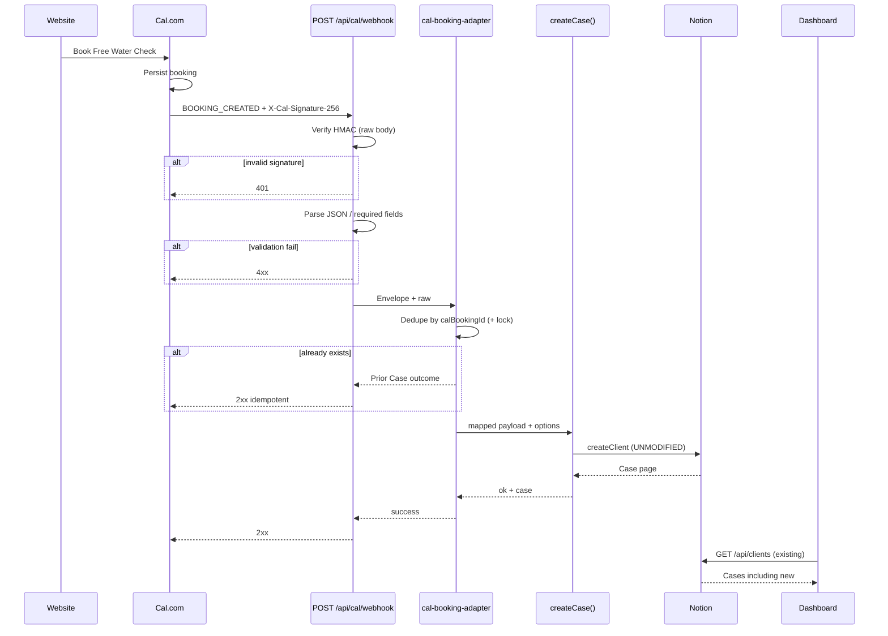

# Cal.com → Portal — Production Recovery / Integration Plan

**Mode:** Architecture / implementation plan only — **no code, no patches, no deploy**  
**Date:** 2026-08-05  
**Basis:** Production Debug Audit — failure after Cal stores booking; Portal never receives events; prod has no Cal webhook route; Cal UI has zero webhooks  

**Immutable production surfaces (must not break):**

Offer · Booking API contracts (`POST /api/cases`, etc.) · Dashboard · Workflow · Notification · LINE OA · Notion schema (additive only) · Public reports · Feedback · OCR · Water Score · Care/Customer flags (remain OFF)

---

## Architecture

```text
[Public Website / Framer]
        │  embed only (no Case create)
        ▼
[Cal.com]  = External Intake Channel (not Ops SSOT)
        │  BOOKING_CREATED (signed webhook)
        ▼
[Portal] POST /api/cal/webhook
        │  verify → validate → dedupe → adapter map
        ▼
[Case Domain] createCase(..., { skipMap, launchOffer? })
        │  UNMODIFIED entry (same as Manual/API)
        ▼
[Notion Cases] createClient / pages.create
        ▼
[Dashboard] GET /api/clients  (unchanged read path)
```

| Component | Owns | Must not own |
|-----------|------|----------------|
| Cal.com | Calendar booking, external booking id, attendee submit | Workflow, notificationStatus, Offer math, Care |
| Cal Adapter | Verify, map, dedupe gate, call Case APIs | Notion schema rewrite, Offer algorithms |
| Case / `createCase()` | Ops SSOT after ingest | Cal UI |
| Offer | Counts Cases with campaign | Cal rows |
| Dashboard | Displays Notion Cases via existing API | Direct Cal reads |

**Decision (Q1): Webhook, not polling**

| Option | Verdict |
|--------|---------|
| **Webhook** | **Selected** — event-driven; matches Cal product; low latency; same pattern as LINE webhook |
| Polling Cal API | Rejected as primary — adds scheduler, API key surface, lag, duplicate-detection complexity; optional later as ops backfill only |

Polling may be a **future ops tool** for missed events; it is **not** the production booking pipeline.

---

## Sequence Diagram



---

## Execution Flow

```text
Cal Booking Created
  → Webhook POST /api/cal/webhook
  → Validation (signature, JSON, required mapped fields)
  → Durable dedupe (calBookingId lookup + withCaseLock)
  → Mapping (Cal → CUSTOMER_INPUT_FIELDS + options)
  → createCase(mapped, { skipMap: true, launchOffer: <map>, correlationId })
  → Notion Case
  → Dashboard via existing GET /api/clients
```

**Out of v1 pipeline (later PR):** `BOOKING_CANCELLED` / `BOOKING_RESCHEDULED` (same adapter family, separate phase).

---

## Answers (1–10)

### 1. Webhook vs polling
**Webhook.** Event-accurate, already supported by Cal, aligns with LINE webhook ops model. Polling is not the primary path.

### 2. Webhook endpoint

| Layer | Name | Responsibility |
|-------|------|----------------|
| **Route** | `POST /api/cal/webhook` | HTTP, raw body, status codes |
| **Route** | `GET /api/cal/webhook/status` | Ops probe (configured? phase? createsCases?) — no secrets |
| **Controller** | `api/cal-routes.js` | Read body; signature gate; dispatch to adapter; ack policy |
| **Service (adapter)** | `services/cal-booking-adapter.js` | Map, validate mapped shape, dedupe, call `createCase` / later cancel |
| **Service (crypto)** | `services/cal-webhook.js` | Secret + HMAC verify (reuse/extend Phase 0) |
| **Case (unchanged)** | `createCase` in `case-creation-service.js` | Sole Case creator |

Must be **deployed to production** (today prod commit has no Cal route).

### 3. Direct `createCase` vs adapter
**Adapter.** Keeps Cal payload/schema out of Case domain; preserves `createCase` contract; allows signature/dedupe/mapping without touching M3/M5/Offer/Workflow. Route must **not** invent a second Notion writer.

### 4. `services/cal-booking-adapter.js` — responsibilities only

- Accept verified Cal envelope  
- Extract correlation ids (`calBookingId`, delivery id)  
- Map to `CUSTOMER_INPUT_FIELDS` (+ `source: 'cal.com'`)  
- Resolve `launchOffer` / `campaignOffer` from event-type table (Product-approved)  
- Enforce required fields before calling Case  
- Durable dedupe: lookup existing Case by `calBookingId`; serialize with `withCaseLock`  
- Call **`createCase(mapped, { skipMap: true, launchOffer, correlationId })` only**  
- Return structured outcome (created | duplicate | rejected)  
- **Must not:** rewrite Offer, write `notificationStatus`, call Care, fuzzy-match identity, direct `pages.create`

### 5. Payload mapping (design; paths freeze after WM sample)

| Cal field (semantic) | Portal field | Notion field (via existing mapper aliases) |
|----------------------|--------------|--------------------------------------------|
| Booking uid / id | `calBookingId` (new Case property) | New text property **Cal Booking ID** (additive) |
| Attendee / responses name | `fullName` | Title / Full Name aliases |
| Email | `email` | Email |
| Phone | `phone` | Phone |
| Start time | `appointmentDate` + `appointmentStart` | Appointment date/time props |
| End time | `appointmentEnd` | End time |
| Event type id/slug | → `options.launchOffer` / `campaignOffer` | Campaign Offer (select) when attributed |
| — | `source = 'cal.com'` | Source |
| Delivery/event id | dedupe registry only | **Not** a Case ops field |

**Until WM payload is captured:** concrete JSON paths remain **UNKNOWN** — plan forbids guessing. Mapping table above is semantic; implementer fills paths from real sample before coding mapper.

### 6. Validations before `createCase`

1. Signature valid when `CAL_WEBHOOK_SECRET` set (prod: secret **required**)  
2. Body is JSON  
3. Trigger is handled event (`BOOKING_CREATED` for create phase)  
4. `calBookingId` present and non-empty  
5. Mapped `fullName` present (same rule as `validateCustomerInput`)  
6. Appointment start mappable (required for ops schedule)  
7. Event type present enough to run Offer map (unknown type → no launch attribution, per locked default)  
8. Dedupe: if Case already exists for `calBookingId` → **do not** call `createCase` again  

Fail closed: 4xx/401; no Notion write.

### 7. Duplicate prevention

| Mechanism | Role |
|-----------|------|
| **`calBookingId`** | Primary business key; at most one Case; Notion lookup after property exists |
| **Webhook delivery / event id** | Secondary processing dedupe (ignore pure redelivery) |
| **`withCaseLock(calBookingId)`** | Serialize concurrent creates (reuse workflow-service lock pattern) |
| **M5 `idempotency-store` (30s)** | Remains for `POST /api/cases` only — **not** replaced; Cal uses Case-id durability instead |
| **Retries** | Same keys → idempotent 2xx with existing Case |

### 8. Webhook retries

- Transient Notion/`createCase` failure → **non-2xx** so Cal retries  
- Ack **only after** durable create **or** durable dedupe hit  
- After success, Cal retry → lookup finds Case → 2xx, zero new Case  
- Invalid signature / permanent validation → **4xx/401**, no retry value  

### 9. Failure logging

- Use existing `logEvent` / correlation id (`cal-…`)  
- Log: trigger, dedupe fingerprint (not full PII), outcome (`created`/`duplicate`/`rejected`), Notion id on success, error class on failure  
- Never log webhook secret or raw signature  
- Prefer structured fields over dumping full attendee payload in prod  

### 10. Production rollout phases

| Phase | Goal | Creates Cases? | Prod Cal webhook? |
|-------|------|----------------|-------------------|
| **1 Receive-only** | Deploy `POST /api/cal/webhook`; verify + log; `createsCases: false` | No | Staging first; optional ping to confirm delivery |
| **2 Mapping** | Adapter maps + validates; still no create (or dry-run log mapped object) | No | Staging |
| **3 Case creation** | Adapter → `createCase`; durable dedupe; Offer map | Yes (staging) | Staging webhook only |
| **4 Production** | Register Cal webhook to prod URL; secret set; monitor | Yes | Prod after checklist |

Aligns with prior PR-1…3 sequencing; cancel/reschedule = follow-on after create is stable.

---

## Mapping Table (semantic checklist for implementers)

| # | Cal semantic | Portal | Required | Notes |
|---|--------------|--------|----------|-------|
| 1 | Booking identifier | `calBookingId` | Yes | Additive Notion text prop |
| 2 | Name | `fullName` | Yes | Blocks create if empty |
| 3 | Email | `email` | No | Recommended |
| 4 | Phone | `phone` | No | Path often custom Q — confirm sample |
| 5 | Start/end | appointment* | Yes / Yes | Timezone-safe conversion |
| 6 | Event type | launchOffer map | Yes for Offer-safe | Unknown ≠ Launch |
| 7 | Delivery id | dedupe only | Yes | Not Case field |

---

## Failure Handling

| Failure | Behavior | Owner |
|---------|----------|-------|
| No Cal webhook registered | No events — ops config | Cal admin |
| Prod missing route | SPA/404 — deploy Phase 1 | Eng |
| Bad signature | 401 | Adapter |
| Bad/missing map fields | 4xx | Adapter |
| Duplicate / retry | 2xx + existing Case | Adapter + Case |
| Notion down | 5xx; Cal retries; one Case after recovery | Case/Notion + dedupe |
| Unknown event type | Create without launch (default) or Product reject | Adapter policy |

---

## Rollback Plan

1. **Disable Cal webhook** in Cal dashboard (stops ingress)  
2. Optionally unset/rotate `CAL_WEBHOOK_SECRET` (rejects signed traffic)  
3. Or disable Cal route registration (removes caller only)  
4. **Do not** delete Notion Cases already created  
5. Offer/Dashboard/Workflow/LINE/Notification code paths untouched — rollback is intake-only  

---

## Regression Matrix

| Area | Must remain green |
|------|-------------------|
| `POST /api/cases` Manual/API | QA-B01–B04 |
| Offer counting | QA-O01–O03 |
| Dashboard `GET /api/clients` | Loads Notion; cancelled filter unchanged |
| Workflow start/close/send | Unchanged |
| LINE webhook | Unchanged |
| Notification SM | Untouched by Cal |
| Care / Customer flags | Stay OFF |
| Reports / Feedback / OCR / Score | Untouched |

Cal-specific QA (after phases): create once; duplicate; bad signature; Notion fail/retry; Offer attribution / non-attribution.

---

## Production Checklist

### Before any prod Case create from Cal

- [ ] WM `BOOKING_CREATED` payload captured (CAL-G01 paths frozen)  
- [ ] Product event-type → `launchOffer` table signed (CAL-G03)  
- [ ] Notion **Cal Booking ID** property added (additive) + mapper alias  
- [ ] Phase 1 route live on staging; status JSON (not SPA HTML)  
- [ ] `CAL_WEBHOOK_SECRET` set staging + prod  
- [ ] Cal webhook URL = `https://<portal>/api/cal/webhook`  
- [ ] Triggers include `BOOKING_CREATED`  
- [ ] Staging E2E: Cal book → Case → Dashboard  
- [ ] Duplicate / retry tests pass  
- [ ] Rollback drill (disable webhook) documented  
- [ ] Prod webhook enabled only after Phase 3 sign-off  

### Must not do in this program

- Rewrite Offer / M5 idempotency / Notification / LINE / Workflow  
- Fuzzy Case match by name  
- Polling as primary pipeline  
- Enable Care/Customer flags for Cal  
- Register prod webhook before staging Case-create proof  

---

## Summary

| Question | Plan answer |
|----------|-------------|
| How to recover | Deploy Cal webhook pipeline → adapter → existing `createCase` |
| Primary mechanism | **Webhook** |
| Failure today | No Cal webhook + no prod Cal endpoint + no create wiring |
| Architecture change | **Additive intake only**; Case remains SSOT |

**No implementation. No code. No patches.**
