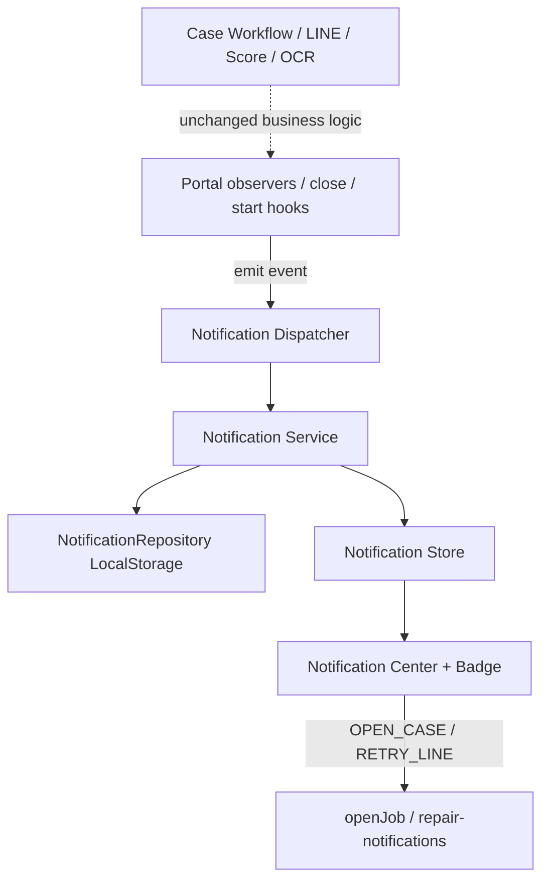

# Operator Notification Center — Phase 1

## 1. Architecture Diagram



## 2. Folder Structure

```
src/js/notifications/
  types.js
  events.js
  utils.js
  repository.js
  mapper.js
  store.js
  service.js
  dispatcher.js
  scheduler.js
  observer.js
  bridge.js
  index.js
  components/
    notification-badge.js
    notification-item.js
    notification-center.js
docs/NOTIFICATION_CENTER_PHASE1.md
```

## 3. Event Flow

| Operator event | Source | Emit |
|---|---|---|
| NEW_CASE | JOBS sync detects new id; manual create; Notion create | `CASE_CREATED` |
| CASE_ASSIGNED | `openJob` → start API ok | `CASE_ASSIGNED` |
| TOMORROW_REMINDER | Scheduler on sync (once/day) | `TOMORROW_REMINDER` |
| TODAY_JOBS | Scheduler on sync (once/day) | `TODAY_JOBS` |
| RESULT_SENT | `finalizeCaseCompletion` LINE sent | `RESULT_SENT` |
| LINE_FAILED | close result failed/skipped; JOBS with `notification.status=failed` | `LINE_FAILED` |
| OVERDUE | Scheduler: past start, not started | `OVERDUE` |

## 4. Data Model

```
Notification {
  id, type, title, message, caseId, customerName,
  createdAt, read, readAt, priority, action, payload, dedupeKey
}
```

Priority: INFO | SUCCESS | WARNING | CRITICAL  
Action: OPEN_CASE | OPEN_CASE_LIST | RETRY_LINE | VIEW_SCHEDULE | NONE

## 5. Repository Design

- Interface style via `MemoryNotificationRepository`
- Phase 1: `LocalStorageNotificationRepository`
- Future drop-in: Notion / DB repository with same methods: `list`, `save`, `findByDedupeKey`, `markRead`, `markAllRead`, `clearRead`, `unreadCount`

## 6. Dispatcher Design

`OperatorNotificationDispatcher.emit(eventName, payload)` → Service.createFromEvent → Store refresh. UI never called from workflow.

## 7. UI Flow

Bell → Badge (unread) → Modal → filters (all/unread/schedule/service) → item → mark read → action button.

## 8. Lifecycle

Create (deduped) → Unread → Open/Mark read → optional Clear read → History remains until cleared.

## 9. Future Extension

- Server Notification API + multi-device sync
- NotionNotificationRepository
- Realtime (poll/SSE)
- More operator types (payment waiting) without changing UI architecture
- Developer Monitoring separate from Operator Center

## Production impact confirmation

| Area | Impact |
|---|---|
| Case workflow services | **None** (no edits to `workflow-service` / `case-creation-service`) |
| LINE delivery | **None** (reuse existing repair API from UI action only) |
| Score engine | **None** |
| Public report | **None** |
| OCR | **None** |

Thin client hooks only: `job-state.js` (sync), `job.js` (assigned), `common.js` (close result), `dashboard.js` (replace placeholder UI), `app.js` (init).
