# 01 — As-Built Architecture (Discovery)

**Source of truth for this doc:** current codebase (reverse-engineered)  
**Intended architecture reference:** `docs/WATER_MOTION_ARCHITECTURE_GUIDE.md`, M8–M9 docs  
**Entry points:** `server.js` · SPA `index.html` / `src/js/app.js`

---

## Phase 1 — High-level architecture

### 1.1 Domains and module boundaries

| Domain | Primary modules | Responsibility |
|--------|-----------------|----------------|
| **Booking** | `case-creation-service.js`, `booking-validation.js` | Validate intake; create Case with system defaults |
| **Case** | `notion/clients.js`, `notion/mapper.js` | Persist operational aggregate (“Clients” Notion DB) |
| **Offer** | `water-check-offer-service.js` | Campaign slot capacity SoT (counts active offer Cases) |
| **Workflow** | `workflow-service.js` | LINE link, start/close, result send SM, feedback bridge, score |
| **Notification (result)** | `workflow-service.js` + `line-notifications.js` | Case-owned `notificationStatus` + result Flex push |
| **Customer Domain** | `services/customer-domain/*` | Identity match/create/link; LINE/notify **read** paths |
| **Migration** | `services/migration/*` | Dual-write, backfill, reconcile, merge (adjacent to Customer) |
| **Care Lifecycle** | `services/care-lifecycle/*` | Eligibility, Care Audit, care LINE push, outcomes |
| **Feedback** | `client-feedback.js` + workflow | Feedback Notion DB + Case feedback status/tokens |
| **Report / Score** | case-flow public routes, `url-builder`, `score-share-card` | Tokenized public report + score assets |
| **LINE OA** | `api/line-routes.js`, `line-notifications.js` | Webhook, signature, push/reply |
| **Ops / Care CLI** | `api/ops-routes.js`, `scripts/run-care-*.js` | Health/readiness; Care scan/report (not SPA-critical) |

### 1.2 Ownership (who owns / may read / may update / lifecycle)

#### Case (Operational SSOT)

| Aspect | Detail |
|--------|--------|
| **Owns** | Booking fields, job/workflow status, campaign offer link, Case LINE fields, `notificationStatus` / `resultSentAt`, feedback status + tokens, report tokens, score fields |
| **May read** | Workflow, offer counter, Care eligibility, Customer linker (link fields), public report/feedback by token, SPA/API |
| **May update** | `case-creation-service`, `workflow-service`, `notion/clients` writers used by those services; cancel appointment paths |
| **Must not update** | Care runtime (observe only); Customer Domain must not rewrite Case notification SM |
| **Lifecycle** | create (`not_sent`) → link LINE (`ready`) → start → close → send result (`sending`/`sent`/`failed`) → feedback/report/score |

#### Customer (Identity only)

| Aspect | Detail |
|--------|--------|
| **Owns** | `customerId`, normalized phone/email/LINE ids, `consentLine`, identity timestamps |
| **May read** | dual-write/resolver, line-reader, notify-reader, Care destination (if READ_NOTIFY), merge/reconcile |
| **May update** | `customer-domain/repository` via creator/resolver/linker/merge/reconcile — **only when flags allow** |
| **Lifecycle** | match exact → create if needed → link Case; optional manual merge; consent may flip later |
| **Must not own** | Booking, workflow, offer slots, result notification state, Care policy |

#### Offer

| Aspect | Detail |
|--------|--------|
| **Owns** | Slot total/remaining computation for named campaign offer |
| **May read** | Public API, booking create (campaign resolution) |
| **May update** | Does not own Case rows; Case cancel/create changes counts indirectly |
| **Lifecycle** | Cache (~60s) → recount active offer Cases → status JSON |

#### Workflow

| Aspect | Detail |
|--------|--------|
| **Owns** | Case state transitions and orchestration of result send / feedback ensure |
| **May read** | Case, Feedback DB, notify-reader, LINE |
| **May update** | Case via Notion; Feedback via `client-feedback`; dual-write after link |
| **Lifecycle** | Per Case operational progression (see Case) |

#### Booking

| Aspect | Detail |
|--------|--------|
| **Owns** | Intake validation + initial Case shape (not a separate DB entity) |
| **May read** | Offer status for campaign |
| **May update** | Creates Case; triggers dual-write hook |
| **Lifecycle** | Request → validate → Case create → optional Customer sync |

#### Feedback

| Aspect | Detail |
|--------|--------|
| **Owns** | Feedback Notion DB records |
| **Case holds** | feedback token/status pointers |
| **May update** | `recordFeedback` / `submitCaseFeedback` / ensure helpers |
| **Lifecycle** | token issued at create → customer submits → Case status updated |

#### Report

| Aspect | Detail |
|--------|--------|
| **Owns** | Public presentation of Case report data via `rpt-*` token |
| **May read** | Public/unauthenticated with valid token |
| **May update** | Report content lives on Case; tokens set at create/workflow |
| **Lifecycle** | token → public HTML/API → optional score card |

#### Notification (result send)

| Aspect | Detail |
|--------|--------|
| **Owns** | Case `notificationStatus` state machine + result Flex content |
| **May read** | Destination via Case LINE and optional Customer notify-reader |
| **May update** | **Only** workflow-service Case updates (`sending`/`sent`/`failed`) |
| **Lifecycle** | `not_sent` → `ready` → `sending` → `sent` \| `failed` → repair/retry |
| **Isolated from** | Care Audit / Care SEND |

#### Care

| Aspect | Detail |
|--------|--------|
| **Owns** | Eligibility policy, CareAuditEvent store, care templates, outcomes, governance docs/CDRs |
| **May read** | Case history for eligibility; optional Customer LINE if READ_NOTIFY |
| **May update** | Care audit files (± Notion Care Audits); **never** Case `notificationStatus` |
| **Lifecycle** | evaluate → skip/dry_run/send → audit → optional outcome measure → CDR for policy change |
| **Flags** | ENABLED / SEND / OUTCOME_* default OFF; SEND requires ENABLED |

---

## Phase 2 — Diagrams

### Diagram 1 — System diagram

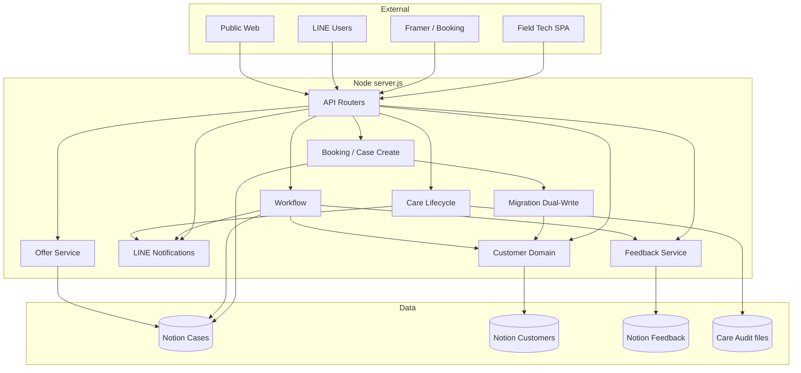

### Diagram 2 — End-to-end user flow (ops chain)

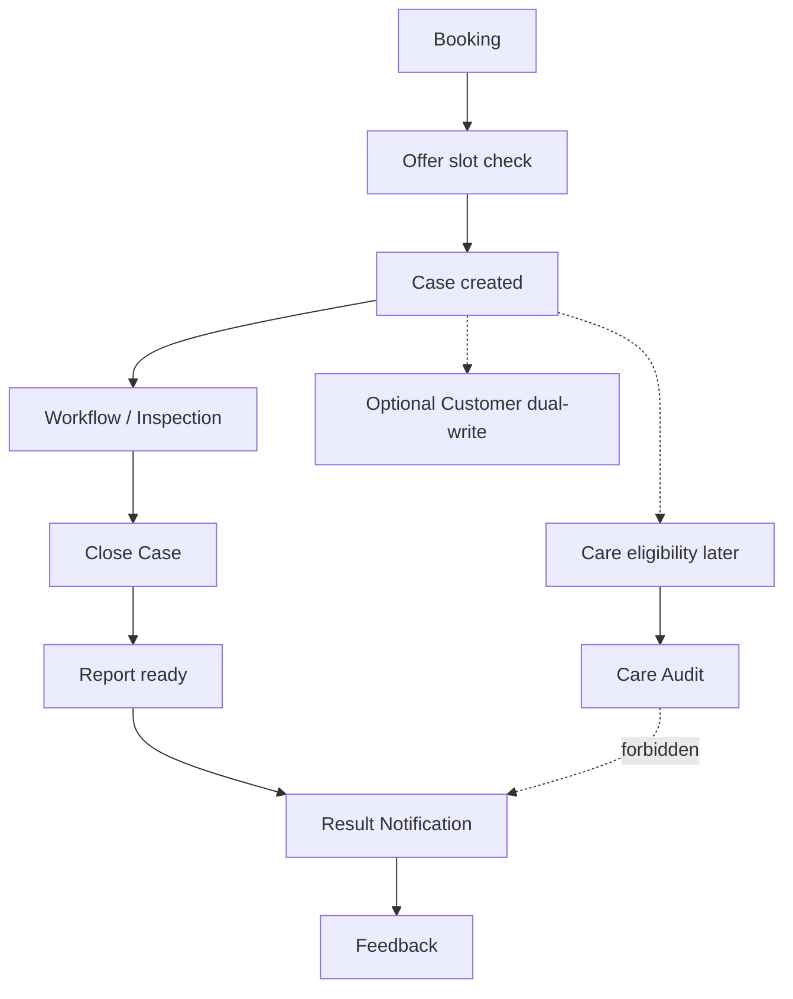

### Diagram 3 — Use case diagram

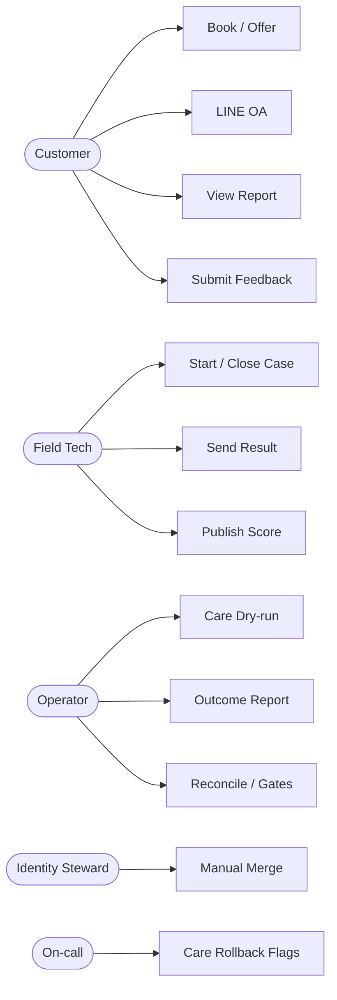

### Diagram 4 — Sequence: Booking → Case

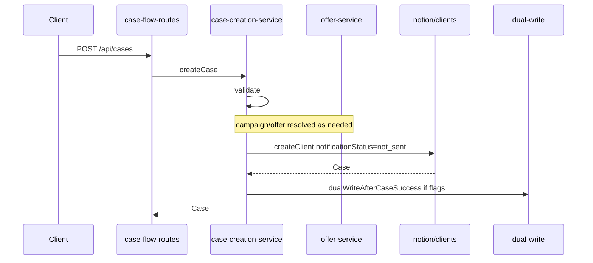

### Diagram 5 — Sequence: Result notification

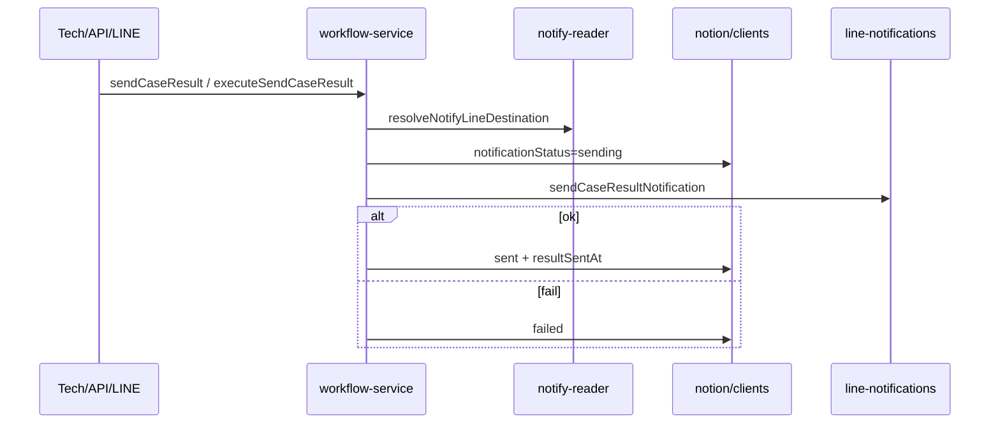

### Diagram 6 — Sequence: Customer identity lookup (LINE)

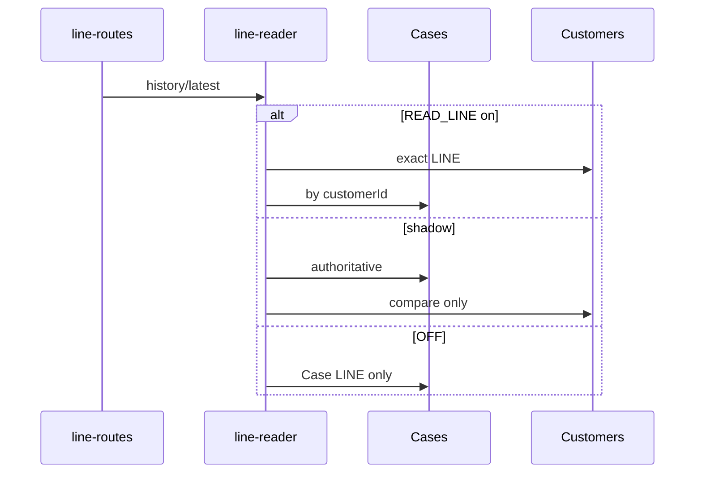

### Diagram 7 — Sequence: Care lifecycle

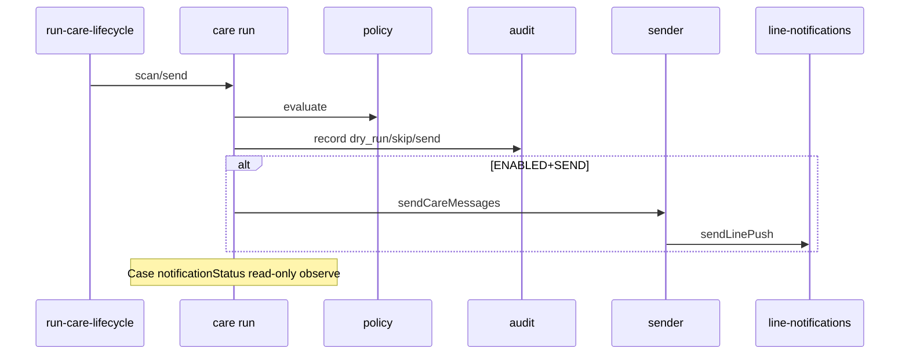

### Diagram 8 — Sequence: Feedback

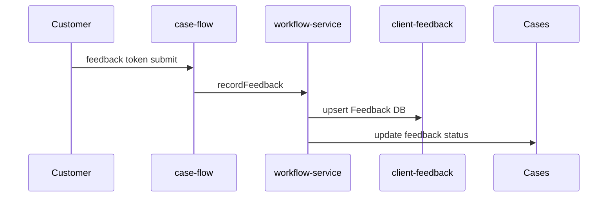

### Diagram 9 — Class / module diagram

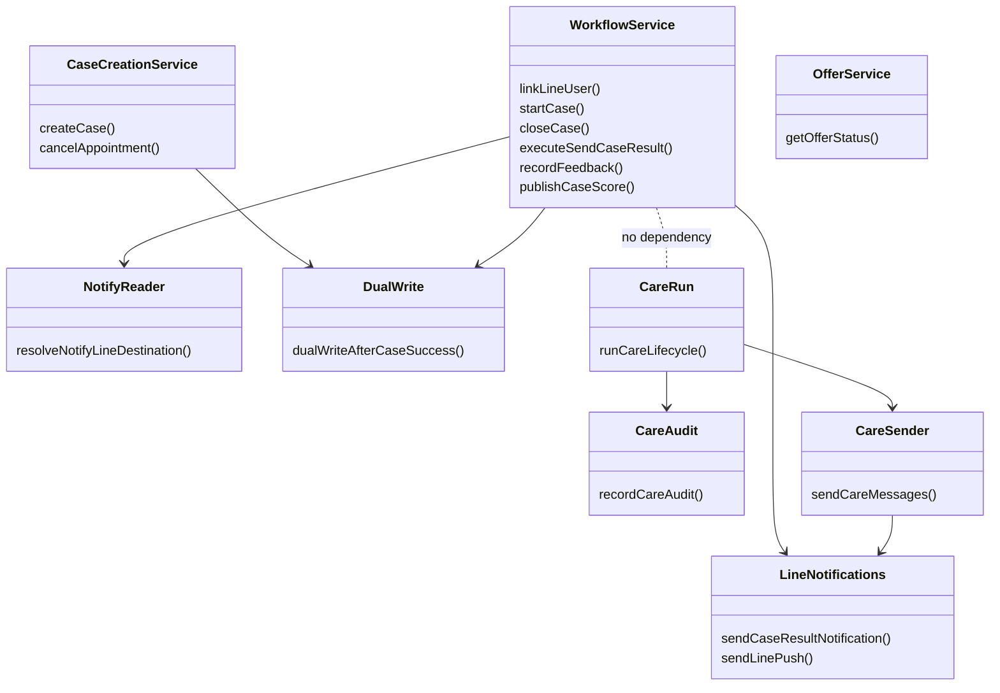

### Diagram 10 — Data flow diagram

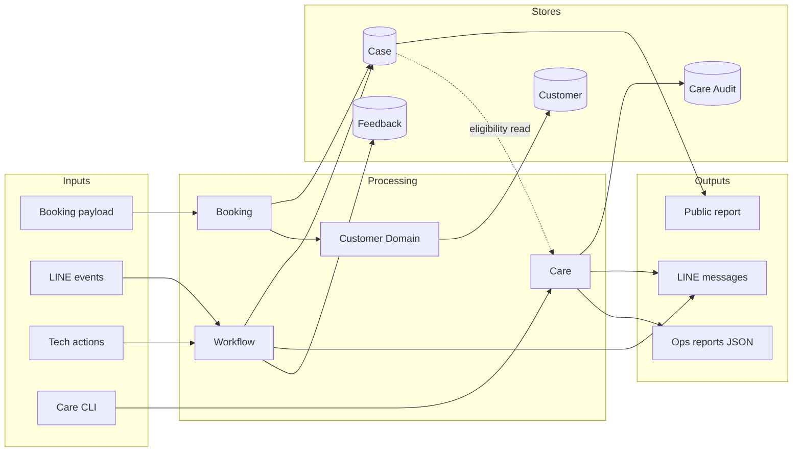

### Diagram 11 — Domain relationship / ownership highlight

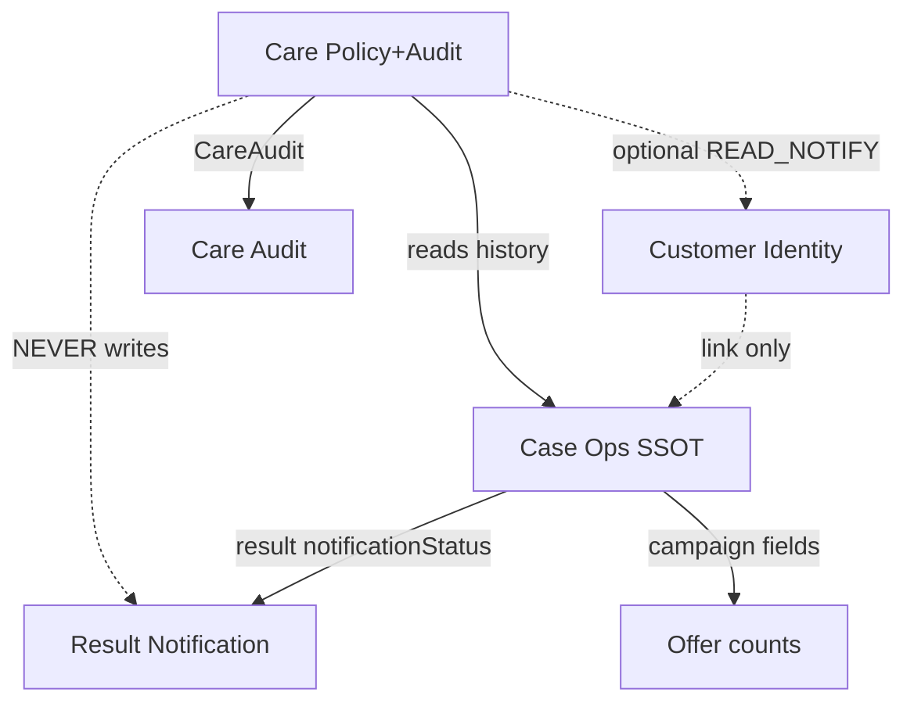

### Diagram 12 — Feature flag relationships

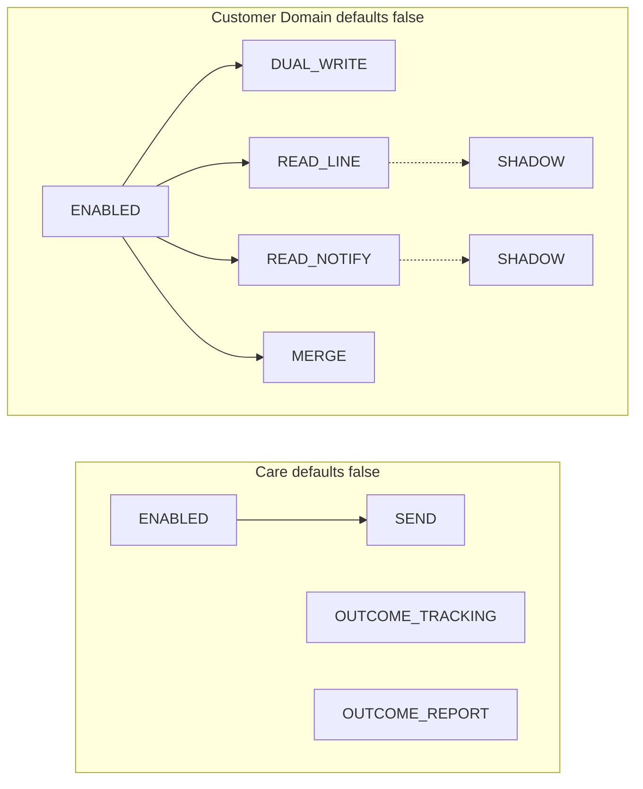

---

## Key file index

| Concern | Path |
|---------|------|
| Server | `server.js` |
| Case create / cancel | `services/case-creation-service.js` |
| Workflow / notify SM | `services/workflow-service.js` |
| Offer | `services/water-check-offer-service.js` |
| LINE | `services/line-notifications.js`, `api/line-routes.js` |
| Customer flags | `services/customer-domain/flags.js` |
| Care flags / run | `services/care-lifecycle/flags.js`, `run.js` |
| Dual-write | `services/migration/dual-write.js` |
| Intended arch | `docs/WATER_MOTION_ARCHITECTURE_GUIDE.md` |

**Diagram count in this file: 12**
